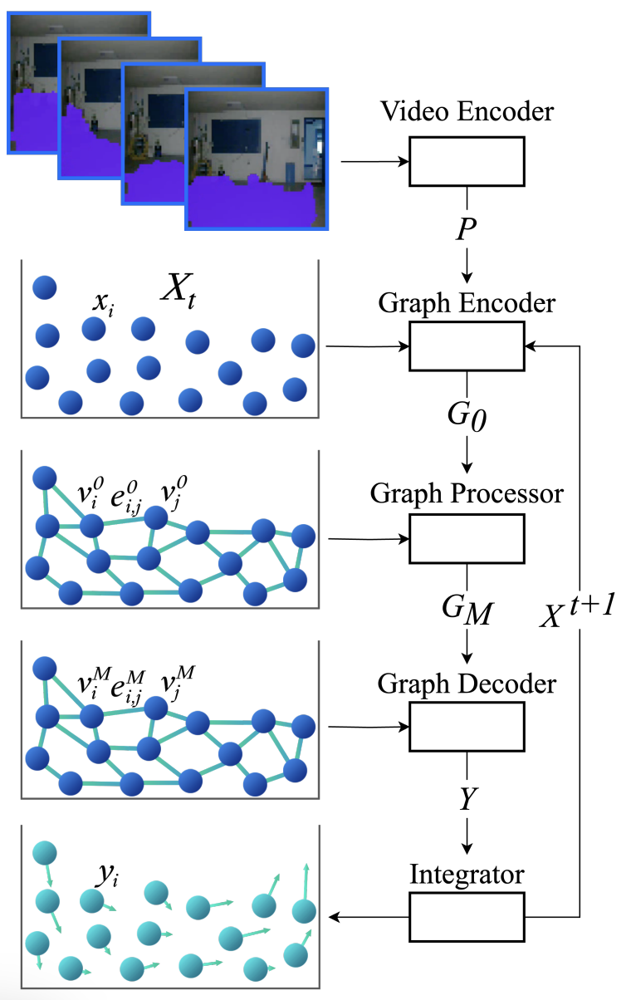
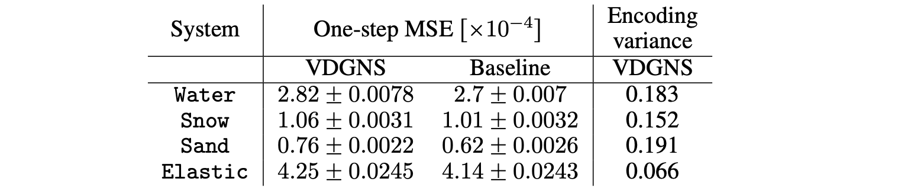
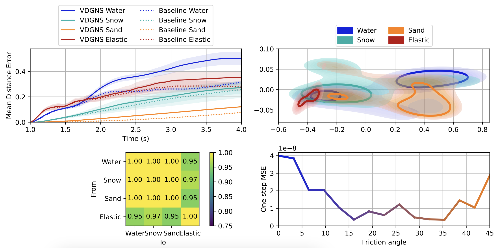

# Video-Driven Graph-Network Based Simulator

## Abstract

Lifelike visualizations in design, cinematography, and gaming rely on precise physics simulations, typically requiring extensive computational resources and detailed physical input. This paper presents a method that can infer a system's physical properties from a short video, eliminating the need for explicit parameter input, provided it is close to the training condition. The learned representation is then used within a Graph Network-based Simulator to emulate the trajectories of physical systems. We demonstrate that the video-derived encodings effectively capture the physical properties of the system and showcase a linear dependence between some of the encodings and the system's motion.

## Architecture

This architecture integrates two components: a Video Encoder, which captures the system's physical properties, and a standard Graph Network-based Simulator (GNS). Given a sequence of video frames representing a system, the Video Encoder generates a latent vector representing the system's physical attributes, allowing the full trajectory of the system to be inferred from an initial condition. Training involves a customized batching process to ensure the Video Encoder focuses on the system's physical properties rather than specific motions. We implement the Video Encoder using a an LSTM, and the GNS components as Multi-Layer Perceptrons.

## Results

The results show that VDGNS performs similarly to the Baseline in terms of one-step MSE, as seen in Table below, though the Baseline slightly outperforms VDGNS. 

The top-left plot in the following Figure further confirms this similarity. We also assessed the effectiveness of the physical encodings generated by the Video Encoder. Using Principal Component Analysis, the top-right plot reveals meaningful representations, where water and sand systems share similarities, as do elastic and snow systems. Additionally, we found a strong linear relationship between video encodings and predicted accelerations, as indicated by the $R^2$ score in the bottom-left plot. Finally, we tested the model's interpolation capabilities by adjusting the angle of friction for sand, showing smooth interpolation between water and sand behaviors, as depicted in the bottom-right plot.

